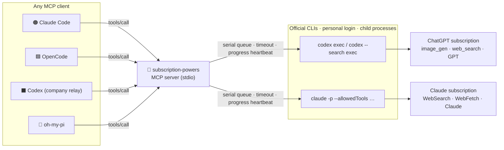

<div align="center">

# 🔌 subscription-powers

**Turn your ChatGPT (Codex) and Claude (Claude Code) subscriptions into MCP tools any agent can call.**

Image generation · Live web search · Page fetch · Subscription-billed task runner — with zero API keys.

[](./LICENSE)
[](https://nodejs.org)
[](https://modelcontextprotocol.io)
[](https://github.com/openai/codex)
[](https://docs.anthropic.com/en/docs/claude-code)

**🌐 Language:** English · [简体中文](./README.md)

[Why](#-why) · [Tools](#-tools) · [How it works](#%EF%B8%8F-how-it-works) · [Quick start](#-quick-start) · [Connect your agent](#-connect-your-agent) · [Cost & latency](#-cost--latency) · [Troubleshooting](#-troubleshooting)

</div>

---

## 💡 Why

Subscriptions bundle capabilities that plain API relays and self-hosted models don't have:

| Capability | 🧠 OpenAI-compatible relay / local model | 🟢 ChatGPT subscription (Codex) | 🟠 Claude subscription (Claude Code) |
|---|:---:|:---:|:---:|
| 🎨 Image generation & editing (`gpt-image-2`) | ✗ | ✓ `image_gen` | ✗ |
| 🌐 Live web search | ✗ | ✓ native `web_search` | ✓ `WebSearch` |
| 📄 Server-side page fetch with cache | ✗ | – | ✓ `WebFetch` |
| 💳 Billing | per token | flat monthly | flat monthly |

**subscription-powers** exposes exactly those subscription-only powers as standard MCP tools, so *every* agent you run — OpenCode, oh-my-pi, a Codex pointed at a company relay, even Claude Code itself — can borrow them.

> [!IMPORTANT]
> This project never reads, copies or forwards your credentials. It only spawns the official `codex` / `claude` CLIs as child processes, exactly the way you would in a terminal. Nothing here talks to OpenAI or Anthropic backends directly.

---

## 🧰 Tools

| Tool | Backend | What it does |
|---|---|---|
| 🎨 `codex_generate_image` | `codex exec` → built-in `image_gen` | Generate a PNG (1024², 1536×1024, 1024×1536). Style hints, transparent background, reference image. |
| ✂️ `codex_edit_image` | `codex exec` → `image_gen` edit | Edit an existing image with a natural-language instruction; optional mask. |
| 🔎 `codex_web_search` | `codex --search exec` | OpenAI native `web_search` inside Codex. Answer + source URLs + token usage. |
| 🌐 `claude_web_search` | `claude -p` + `WebSearch`/`WebFetch` | Anthropic-side search. Answer + sources + list-price cost + turn count. |
| 📄 `claude_web_fetch` | `claude -p` + `WebFetch` | Fetch one URL (server-side, 15-min cache) and answer a question about it. |
| 🤖 `codex_run` | `codex exec` | Run an arbitrary task on the subscription GPT model (read-only sandbox by default). |
| 🧑‍💻 `claude_run` | `claude -p` | Run an arbitrary task on the subscription Claude model (read-only tools by default). |

Every result is JSON with `ok`, the payload, `elapsed_ms`, and usage (`tokens` for Codex, `cost_usd_list_price` + `turns` for Claude) so the calling agent can reason about quota.

---

## ⚙️ How it works



Design rules that keep it boring and safe:

- 🔒 **Credential-free.** Child processes get a scrubbed environment: `CLAUDECODE`, `CLAUDE_CODE_*`, `CLAUDE_CONFIG_DIR`, `ANTHROPIC_*`, `CODEX_HOME`, relay API keys are all removed, so the CLIs always run under your *personal* `~/.codex` and `~/.claude` — even when the caller is a company-configured agent.
- 🚦 **One job per backend at a time.** A serial queue per CLI; cold starts and quota don't like concurrency.
- ⏱️ **Timeouts with teeth.** SIGTERM then SIGKILL. Long jobs emit MCP `notifications/progress` every 8 s so clients with `resetTimeoutOnProgress` never hit the default 60 s wall.
- 🗂️ **Files, not blobs.** Images are saved where you ask; the model replies `SAVED <path>`, the server `stat`s it, and falls back to the newest PNG in `out_dir`.
- 🛡️ **Path guard.** Absolute paths only; nothing may land inside `~/.codex`, `~/.claude`, `~/.ssh`, `~/.aws`, …

---

## 🚀 Quick start

**Prerequisites**

- Node.js ≥ 20
- `codex` CLI installed and logged in with your ChatGPT account (`codex login`)
- `claude` CLI installed and logged in with your Claude subscription

```bash
git clone https://github.com/we1005/subscription-powers-mcp.git
cd subscription-powers-mcp/server
npm install

# list tools + one cheap WebFetch
npm run smoke
# exercise everything once (generates one image — spends subscription quota)
node tests/smoke.mjs --full
# pick tools
node tests/smoke.mjs --only=codex_web_search,claude_web_search
```

---

## 🔗 Connect your agent

<details open>
<summary><b>🟠 Claude Code</b></summary>

```bash
claude mcp add --scope user subscription-powers -- node /ABS/PATH/subscription-powers-mcp/server/index.mjs
```
Works the same for a second config dir (`CLAUDE_CONFIG_DIR=… claude mcp add …`).
</details>

<details>
<summary><b>🟩 OpenCode</b> — <code>~/.config/opencode/opencode.json</code></summary>

```jsonc
{
  "mcp": {
    "subscription-powers": {
      "type": "local",
      "command": ["node", "/ABS/PATH/subscription-powers-mcp/server/index.mjs"],
      "enabled": true
    }
  }
}
```
</details>

<details>
<summary><b>⬛ Codex CLI</b> — <code>~/.codex/config.toml</code> (or any <code>CODEX_HOME</code>)</summary>

```toml
[mcp_servers.subscription-powers]
command = "node"
args = ["/ABS/PATH/subscription-powers-mcp/server/index.mjs"]
default_tools_approval_mode = "approve"   # tools are read-only except image files you asked for
startup_timeout_sec = 30
tool_timeout_sec = 600
```
Yes — a Codex pointed at a company relay can borrow your *personal* Codex's image generation this way.
</details>

<details>
<summary><b>🥧 oh-my-pi</b> — <code>~/.omp/agent/mcp.json</code></summary>

```json
{
  "mcpServers": {
    "subscription-powers": {
      "command": "node",
      "args": ["/ABS/PATH/subscription-powers-mcp/server/index.mjs"]
    }
  }
}
```
</details>

---

## 💸 Cost & latency

Measured on a ChatGPT Plus + Claude Team setup, macOS, Sept 2026:

| Tool | Typical time | Typical cost |
|---|---|---|
| 🎨 `codex_generate_image` | 45–90 s | ~25–90 K tokens (mostly cached) · ≈1 % of the 5-hour Plus window → roughly **300–500 images/week** |
| 🔎 `codex_web_search` | 25–60 s | ~65 K tokens (≈50 K cached) |
| 🌐 `claude_web_search` | 30–40 s | 4–5 turns · ~$0.4 list price |
| 📄 `claude_web_fetch` | ~12 s | ~$0.3 list price |

Cold-starting a CLI is 5–10 s of every call; batch related questions into one call when you can.

---

## 🩺 Troubleshooting

| Symptom | Meaning | Fix |
|---|---|---|
| `codex_not_authed` / `claude_not_authed` | CLI isn't logged in | run `codex login` / `claude` once in a terminal |
| `codex_timeout` | complex image or slow network | raise `timeout_ms` (max 600 s) |
| `no_image_saved` | model didn't follow the `SAVED` protocol or refused | read `last_message` in the result; rephrase |
| `MCP error -32001: Request timed out` on the **client** | client's 60 s default | enable `resetTimeoutOnProgress` / raise the client tool timeout; server already sends heartbeats |
| `shell_commands_used > 0` in search results | Codex used shell instead of `web_search` (local skills can lure it) | harmless, just slower; the prompt already forbids it |

---

## 🗺️ Roadmap

- [ ] Persistent Codex session (`codex mcp-server` / Agent SDK) to skip cold starts
- [ ] Return small thumbnails inline as MCP image content
- [ ] `codex_generate_image_set` for style-consistent batches
- [ ] Per-tool quota accounting persisted across calls

## 🙏 Credits

- Prompt protocol and error taxonomy inspired by [colin-automates/Codex-ImageGen--Claude-Code](https://github.com/colin-automates/Codex-ImageGen--Claude-Code) (MIT).
- Built on the [Model Context Protocol TypeScript SDK](https://github.com/modelcontextprotocol/typescript-sdk).

## ⚠️ Disclaimer

Use within the terms of your OpenAI and Anthropic subscriptions. This tool automates the official CLIs; it does not bypass rate limits, and heavy image generation consumes your plan's quota quickly.

---

<div align="center"><sub>Made with the two subscriptions I was already paying for.</sub></div>
