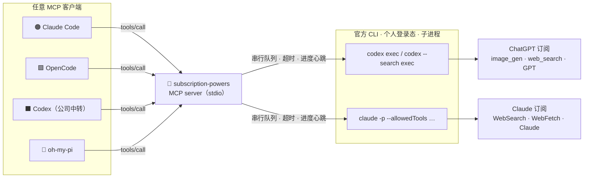

<div align="center">

# 🔌 subscription-powers

**把你的 ChatGPT（Codex）与 Claude（Claude Code）订阅变成任何 Agent 都能调用的 MCP 工具。**

生图 · 联网搜索 · 网页抓取 · 订阅额度跑任务 —— 全程零 API Key。

[](./LICENSE)
[](https://nodejs.org)
[](https://modelcontextprotocol.io)
[](https://github.com/openai/codex)
[](https://docs.anthropic.com/en/docs/claude-code)

**🌐 语言：** 简体中文 · [English](./README.en.md)

[为什么](#-为什么) · [工具](#-工具) · [工作原理](#%EF%B8%8F-工作原理) · [快速开始](#-快速开始) · [接入你的-agent](#-接入你的-agent) · [成本与时延](#-成本与时延) · [排错](#-排错)

</div>

---

## 💡 为什么

订阅里捆着一些普通 API 中转和本地模型给不了的能力：

| 能力 | 🧠 OpenAI 兼容中转 / 本地模型 | 🟢 ChatGPT 订阅（Codex） | 🟠 Claude 订阅（Claude Code） |
|---|:---:|:---:|:---:|
| 🎨 生图 / 改图（`gpt-image-2`） | ✗ | ✓ 内置 `image_gen` | ✗ |
| 🌐 实时联网搜索 | ✗ | ✓ 原生 `web_search` | ✓ `WebSearch` |
| 📄 服务端网页抓取（带缓存） | ✗ | – | ✓ `WebFetch` |
| 💳 计费方式 | 按 token | 月费包干 | 月费包干 |

**subscription-powers** 把这几样"只有订阅才有"的能力原样暴露成标准 MCP 工具，于是你手头的每一个 Agent —— OpenCode、oh-my-pi、接了公司中转的 Codex、甚至 Claude Code 自己 —— 都能借用。

> [!IMPORTANT]
> 本项目**不读、不复制、不转发任何凭据**。它只做一件事：像你在终端里那样，起官方的 `codex` / `claude` 子进程。这里没有任何代码直接连接 OpenAI 或 Anthropic 的后端。

---

## 🧰 工具

| 工具 | 底层 | 作用 |
|---|---|---|
| 🎨 `codex_generate_image` | `codex exec` → 内置 `image_gen` | 生成 PNG（1024²、1536×1024、1024×1536），支持风格提示、透明底、参考图 |
| ✂️ `codex_edit_image` | `codex exec` → `image_gen` 编辑 | 用自然语言修改已有图片，可选遮罩 |
| 🔎 `codex_web_search` | `codex --search exec` | Codex 内的 OpenAI 原生 `web_search`，返回答案 + 来源 URL + token 用量 |
| 🌐 `claude_web_search` | `claude -p` + `WebSearch`/`WebFetch` | Anthropic 侧搜索，返回答案 + 来源 + 标价成本 + 轮数 |
| 📄 `claude_web_fetch` | `claude -p` + `WebFetch` | 抓取一个 URL（服务端抓取、15 分钟缓存）并回答关于它的问题 |
| 🤖 `codex_run` | `codex exec` | 用订阅的 GPT 模型跑任意任务（默认只读沙箱） |
| 🧑‍💻 `claude_run` | `claude -p` | 用订阅的 Claude 模型跑任意任务（默认只读工具） |

每个结果都是 JSON：`ok`、负载、`elapsed_ms`，以及用量（Codex 给 `tokens`，Claude 给 `cost_usd_list_price` 与 `turns`），调用方可以据此掂量额度。

---

## ⚙️ 工作原理



几条让它"无聊但安全"的设计规则：

- 🔒 **零凭据。** 子进程拿到的是清洗过的环境：`CLAUDECODE`、`CLAUDE_CODE_*`、`CLAUDE_CONFIG_DIR`、`ANTHROPIC_*`、`CODEX_HOME`、中转 API Key 全部剥掉，所以 CLI 永远在你**个人**的 `~/.codex` 与 `~/.claude` 下运行 —— 即便调用方是配了公司环境的 Agent。
- 🚦 **每个后端同时只跑一个。** 每条 CLI 一个串行队列；冷启动和额度都经不起并发。
- ⏱️ **有牙齿的超时。** 先 SIGTERM 再 SIGKILL。长任务每 8 秒发一次 MCP `notifications/progress` 心跳，支持 `resetTimeoutOnProgress` 的客户端不会撞上默认 60 秒的墙。
- 🗂️ **落文件，不传大块。** 图片保存到你指定的目录；模型回复 `SAVED <path>`，服务端 `stat` 核验，找不到就取 `out_dir` 里最新的 PNG 兜底。
- 🛡️ **路径守卫。** 只接受绝对路径，且不允许写进 `~/.codex`、`~/.claude`、`~/.ssh`、`~/.aws` 等目录。

---

## 🚀 快速开始

**前提**

- Node.js ≥ 20
- 已安装 `codex` CLI 并用 ChatGPT 账号登录（`codex login`）
- 已安装 `claude` CLI 并用 Claude 订阅登录

```bash
git clone https://github.com/we1005/subscription-powers-mcp.git
cd subscription-powers-mcp/server
npm install

# 列出工具 + 一次便宜的 WebFetch
npm run smoke
# 每个工具都真跑一遍（会生成一张图，消耗订阅额度）
node tests/smoke.mjs --full
# 只挑几个
node tests/smoke.mjs --only=codex_web_search,claude_web_search
```

---

## 🔗 接入你的 Agent

<details open>
<summary><b>🟠 Claude Code</b></summary>

```bash
claude mcp add --scope user subscription-powers -- node /绝对路径/subscription-powers-mcp/server/index.mjs
```
第二套配置目录同理：`CLAUDE_CONFIG_DIR=… claude mcp add …`。
</details>

<details>
<summary><b>🟩 OpenCode</b> — <code>~/.config/opencode/opencode.json</code></summary>

```jsonc
{
  "mcp": {
    "subscription-powers": {
      "type": "local",
      "command": ["node", "/绝对路径/subscription-powers-mcp/server/index.mjs"],
      "enabled": true
    }
  }
}
```
</details>

<details>
<summary><b>⬛ Codex CLI</b> — <code>~/.codex/config.toml</code>（或任意 <code>CODEX_HOME</code>）</summary>

```toml
[mcp_servers.subscription-powers]
command = "node"
args = ["/绝对路径/subscription-powers-mcp/server/index.mjs"]
default_tools_approval_mode = "approve"   # 除你点名要的图片文件外，工具均为只读
startup_timeout_sec = 30
tool_timeout_sec = 600
```
没错 —— 接了公司中转的 Codex，可以这样借用你**个人** Codex 的生图能力。
</details>

<details>
<summary><b>🥧 oh-my-pi</b> — <code>~/.omp/agent/mcp.json</code></summary>

```json
{
  "mcpServers": {
    "subscription-powers": {
      "command": "node",
      "args": ["/绝对路径/subscription-powers-mcp/server/index.mjs"]
    }
  }
}
```
</details>

---

## 💸 成本与时延

2026 年 9 月在 ChatGPT Plus + Claude Team、macOS 上的实测：

| 工具 | 典型耗时 | 典型成本 |
|---|---|---|
| 🎨 `codex_generate_image` | 45–90 s | 约 2.5–9 万 token（大部分命中缓存）· 约占 Plus 5 小时窗口 1 % → 粗估 **每周 300–500 张** |
| 🔎 `codex_web_search` | 25–60 s | 约 6.5 万 token（约 5 万缓存） |
| 🌐 `claude_web_search` | 30–40 s | 4–5 轮 · 标价约 $0.4 |
| 📄 `claude_web_fetch` | 约 12 s | 标价约 $0.3 |

每次调用都有 5–10 秒的 CLI 冷启动；相关问题尽量合并到一次调用里。

---

## 🩺 排错

| 现象 | 含义 | 处理 |
|---|---|---|
| `codex_not_authed` / `claude_not_authed` | CLI 未登录 | 在终端跑一次 `codex login` / `claude` |
| `codex_timeout` | 图太复杂或网络慢 | 调大 `timeout_ms`（上限 600 s） |
| `no_image_saved` | 模型没按 `SAVED` 协定回复，或被内容策略拒绝 | 看结果里的 `last_message`，换个说法 |
| **客户端**报 `MCP error -32001: Request timed out` | 客户端默认 60 秒 | 开 `resetTimeoutOnProgress` 或调大客户端工具超时；服务端已在发心跳 |
| 搜索结果里 `shell_commands_used > 0` | Codex 没用 `web_search` 而是跑了命令（会被本机 skills 诱导） | 无害，只是更慢；提示词里已禁止 |

---

## 🗺️ 路线图

- [ ] 长驻 Codex 会话（`codex mcp-server` / Agent SDK），省掉冷启动
- [ ] 以 MCP image content 内联返回小缩略图
- [ ] `codex_generate_image_set`：风格一致的成组出图
- [ ] 跨调用持久化的按工具额度统计

## 🙏 致谢

- 提示词协定与错误分类借鉴自 [colin-automates/Codex-ImageGen--Claude-Code](https://github.com/colin-automates/Codex-ImageGen--Claude-Code)（MIT）。
- 基于 [Model Context Protocol TypeScript SDK](https://github.com/modelcontextprotocol/typescript-sdk)。
- 设计取舍与调研过程见 [`docs/analysis-and-plan.zh.md`](./docs/analysis-and-plan.zh.md)。

## ⚠️ 声明

请在 OpenAI 与 Anthropic 订阅条款允许的范围内使用。本工具只是把官方 CLI 自动化了，不绕过任何限额；重度生图会很快消耗你套餐的额度。

<div align="center"><sub>用我本来就在付费的两个订阅做的。</sub></div>
